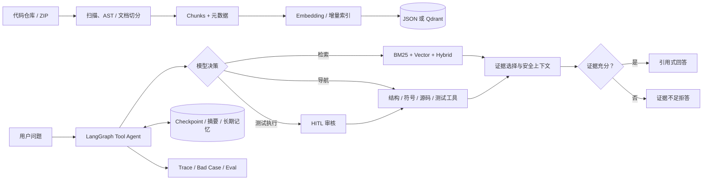
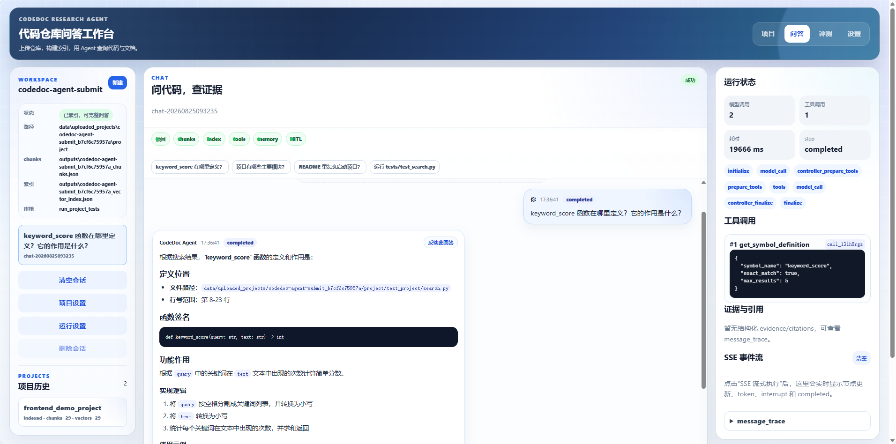
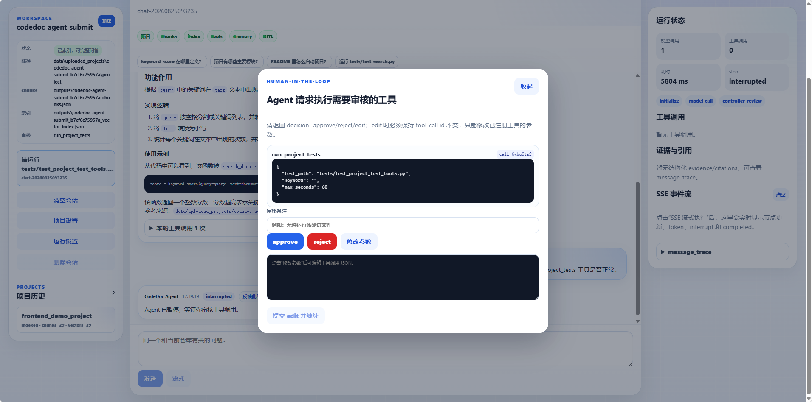

# CodeDoc Research Agent

> 面向代码仓库理解与研发问答的可验证 Agentic RAG 系统：从仓库接入、混合检索到受控工具调用、证据式回答与评测回归。

CodeDoc 允许开发者上传或选择一个代码仓库，构建代码与文档索引后，通过带工具调用能力的 Agent 查询源码、文档、项目结构或测试结果。系统把答案约束在检索证据和工具结果范围内，并提供 Trace、Human-in-the-loop（HITL）和 Bad Case 回归能力。

**技术栈：** Python · FastAPI · Pydantic · LangChain · LangGraph · Qdrant · SQLite · Ollama · bge-m3 · bge-reranker-v2-m3 · React/Vite

## 30 秒了解项目

| 能力 | 说明 |
| --- | --- |
| 代码知识构建 | Python AST 函数/类/方法切分；Markdown、JSON、YAML、TOML 结构化解析。 |
| 混合检索 | BM25、Dense Vector、Hybrid、Query Rewrite、Multi-Query、Reranker。 |
| 受控 Agent | 代码搜索、文档检索、符号定位、源码读取、项目结构、测试执行等工具；支持参数校验、白名单、重复调用限制和 HITL。 |
| 多轮与安全 | Checkpoint、会话摘要、结构化长期记忆、项目/会话隔离、Prompt Injection 扫描和敏感信息脱敏。 |
| 可评测性 | 检索 Benchmark、Agent 任务集、执行 Trace、Bad Case 导出与回归。 |

## 架构



## Demo 场景

启动前端后，选择 `test_project` 或上传 ZIP，依次执行“扫描 → 构建索引 → 问答”。以下问题覆盖了实际工具链：

| 问题 | Agent 主要动作 | 预期能力 |
| --- | --- | --- |
| `keyword_score 函数在哪里定义？它的作用是什么？` | 符号定位 / 源码读取 | 返回源码位置、函数职责与引用证据。 |
| `README 里怎么启动项目？` | 文档检索 | 根据 README/usage 文档回答，而非模型猜测。 |
| `这个项目有哪些主要模块？` | 项目结构查询 | 展示目录与模块概览。 |
| `运行 tests/test_project_test_tools.py` | 测试工具 + HITL | 前端展示工具参数，用户 approve/reject/edit 后再继续。 |

### 前端工作台

<p align="center">
  
</p>

### Human-in-the-loop 审核

<p align="center">
  
</p>

详细操作见 [Demo 指南](docs/demo.md)，指标和数据集说明见 [评测说明](docs/retrieval_experiments.md)。

## 核心能力

- 代码仓库接入：扫描项目文件，解析 Python AST，切分函数、类、方法、Markdown 文档和 JSON/YAML/TOML 配置。
- 检索链路：支持 BM25、向量检索、Hybrid Search、Query Rewrite、Multi-Query 和 Reranker。
- 存储后端：支持本地 JSON 向量索引和 Qdrant 向量数据库。
- RAG 问答：基于检索证据构造上下文，生成引用，校验 Citation，并在证据不足时拒答。
- Agent 工具：封装代码搜索、文档检索、项目结构查询、符号定位、源码读取、测试运行等工具。
- LangGraph 工作流：支持工具路由、证据评估、条件分支、安全停止、Checkpoint、会话摘要和长期记忆。
- Human-in-the-loop：对测试运行等需要确认的工具调用支持 approve、reject、edit。
- 自动化评测：提供 JSONL 评测集和脚本，统计 Recall@K、MRR、NDCG、工具选择准确率、任务成功率和延迟。

## 项目结构

```text
app/
  api/                  FastAPI 路由
  ingestion/            文件扫描、代码解析、chunk 构建
  services/             检索、索引、RAG、异步 Job 等业务服务
  vectorstores/         JSON / Qdrant 向量存储实现
  tools/                自研工具注册、执行与工具函数
  function_calling/     手写 Function Calling 循环
  langchain_agent/      LangChain 模型、工具和中间件集成
  langgraph_agent/      LangGraph Agent、HITL、Checkpoint、SSE
  memory/               结构化长期记忆与会话摘要
  context_engineering/  上下文预算、证据选择、安全上下文
  security/             Prompt Injection 检测与敏感信息脱敏
  evaluation/           检索与 Agent 评测
  mcp/                  MCP 只读适配
  skills/               Agent Skills
frontend/               React + Vite 前端工作台
tests/                  自动化测试
scripts/                实验与运维脚本
data/evaluation/        JSONL 评测集
outputs/experiments/    可保留的实验报告
examples/               示例项目
```

更多后端目录说明见 [app/README.md](app/README.md)。

## 快速启动

项目支持两种启动方式：

- Docker Compose：推荐用于快速体验，启动 FastAPI、前端、Qdrant 和 Redis。
- 本地启动：适合开发调试，需要本机安装 Python、Node.js 和 Ollama。

> 默认模型服务使用宿主机 Ollama。也就是说，Docker Compose 默认不会拉取体积较大的 `ollama/ollama` 镜像，避免首次启动过慢。

### 方式一：Docker Compose 启动（推荐）

先在宿主机启动 Ollama，并拉取模型：

```powershell
ollama pull qwen3.5:4b
ollama pull bge-m3
ollama list
```

然后启动后端、前端、Qdrant 和 Redis：

```powershell
docker compose up --build api frontend qdrant redis
```

访问地址：

```text
前端：http://127.0.0.1:5173
后端 Swagger：http://127.0.0.1:8000/docs
Qdrant Dashboard：http://127.0.0.1:6333/dashboard
```

停止服务：

```powershell
docker compose down
```

如果希望使用容器内 Ollama，或需要了解 Docker Compose 环境变量、数据卷和健康检查，请参考 [Docker Compose 部署说明](docs/docker_compose_deployment.md)。

### 方式二：本地启动

#### 1. 安装 Python 依赖

```powershell
cd codedoc-agent
pip install -r requirements.txt
```

#### 2. 准备 Ollama 模型

```powershell
ollama pull qwen3.5:4b
ollama pull bge-m3
ollama list
```

#### 3. 启动后端

```powershell
$env:LANGCHAIN_CHAT_PROVIDER="openai_compatible"
$env:LANGCHAIN_CHAT_MODEL="qwen3.5:4b"
$env:LANGCHAIN_CHAT_BASE_URL="http://localhost:11434/v1"
$env:LANGCHAIN_CHAT_API_KEY="EMPTY"
$env:LANGCHAIN_CHAT_TIMEOUT_SECONDS="180"
$env:LANGCHAIN_CHAT_MAX_TOKENS="600"
$env:LANGCHAIN_CHAT_MAX_RETRIES="0"
$env:LANGCHAIN_CHAT_TEMPERATURE="0.1"

uvicorn api_main:app --reload --app-dir app
```

访问：

```text
http://127.0.0.1:8000/docs
```

#### 4. 启动前端

```powershell
cd frontend
npm install
npm run dev
```

访问：

```text
http://127.0.0.1:5173
```

前端会通过 Vite 代理请求本地 FastAPI 后端。

## 基础使用流程

1. 在前端上传 ZIP 项目，或使用 `test_project` 示例项目。
2. 点击“扫描”，生成代码和文档 chunks。
3. 点击“构建索引”，生成向量索引。
4. 进入“问答”，围绕当前仓库提问。
5. 对需要确认的工具调用进行 approve / reject / edit。
6. 在“评测”页导入实验报告，或对回答提交反馈并沉淀 Bad Case。

推荐测试问题：

```text
keyword_score 在哪里定义？
项目有哪些主要模块？
README 里怎么启动项目？
运行 tests/test_project_test_tools.py
```

## 自动化测试

运行核心测试：

```powershell
python -m pytest
```

只验证 MCP、Skills、工具调用和检索策略相关测试：

```powershell
python -m pytest `
  tests/test_api_mcp.py `
  tests/test_api_skills.py `
  tests/test_mcp_adapter.py `
  tests/test_skills.py `
  tests/test_tool_call_normalizer.py `
  tests/test_project_test_tools.py `
  tests/test_retrieval_pipeline_strategy.py `
  tests/test_agent_eval_benchmark_dataset.py
```

前端构建：

```powershell
cd frontend
npm run build
```

## 评测与验证

- **检索评测：**构建 100 条人工标注检索样例，统一使用 `Top-K=5`；当前 Hybrid Search 的 **Recall@5 为 89.92%**、**Hit@5 为 99.00%**。
- **Agent 评测：**构建覆盖符号定位、源码读取、文档问答、结构查询、测试执行与安全拒答的 50 条任务集，报告保留工具调用 Trace、失败原因和延迟指标。
- **回归验证：**维护 8 条高价值 Bad Case 回归集，覆盖显式源码读取、文档与入口代码、调用链、结构问答及安全拒答；最近一次真实模型回归 **8/8 通过**。

完整的策略对比、指标定义、实验边界和原始报告见 [评测说明](docs/retrieval_experiments.md)。评测结果受当前任务集、模型版本与本地硬件环境影响，不将其泛化为通用能力结论。

项目内置 JSONL 评测集：

- `data/evaluation/retrieval_experiment_cases.jsonl`
- `data/evaluation/codedoc_agent_eval.jsonl`
- `data/evaluation/agent_bad_case_regression.jsonl`
- `data/evaluation/retrieval_experiment_cases_real_project.jsonl`

部分实验报告保留在：

- `outputs/experiments/retrieval_experiment_report_bge_m3_100.json`
- `outputs/experiments/chunk_experiment_report_latest.json`

> 历史 Agent 评测报告仅用于排查；当前基准为 50 条任务集，新的优化必须重新运行全量基准与人工维护的 Bad Case 回归集。

运行检索评测示例：

```powershell
python scripts/run_retrieval_experiments.py --prepare-mock-index
```

真实模型实验需要先准备好 chunks、向量索引、Ollama Embedding 和本地 Reranker。

运行完整 Agent 基准集（50 条）：

```powershell
python scripts/run_agent_experiments.py `
  --dataset data/evaluation/codedoc_agent_eval.jsonl `
  --output outputs/experiments/agent_eval_report_qwen35_50_latest.json `
  --project-root . `
  --chunks-path outputs/test_project_chunks.json `
  --index-path outputs/test_project_vector_index_bge_m3.json `
  --embedding-provider ollama `
  --embedding-model bge-m3 `
  --embedding-base-url http://localhost:11434 `
  --rerank-provider sentence_transformers `
  --rerank-model D:/models/bge-reranker-v2-m3 `
  --rerank-local-files-only
```

从报告导出失败样本并执行回归：

```powershell
python scripts/export_bad_cases.py `
  --source eval-report `
  --report outputs/experiments/agent_eval_report_latest.json `
  --output outputs/experiments/agent_bad_cases_latest.jsonl

python scripts/run_agent_experiments.py `
  --dataset outputs/experiments/agent_bad_cases_latest.jsonl `
  --output outputs/experiments/agent_bad_case_regression_report.json `
  --project-root . `
  --chunks-path outputs/test_project_chunks.json `
  --index-path outputs/test_project_vector_index_bge_m3.json `
  --embedding-provider ollama `
  --embedding-model bge-m3 `
  --embedding-base-url http://localhost:11434 `
  --rerank-provider sentence_transformers `
  --rerank-model D:/models/bge-reranker-v2-m3 `
  --rerank-local-files-only
```

运行人工维护的关键 Bad Case 回归集：

```powershell
python scripts/run_agent_experiments.py `
  --dataset data/evaluation/agent_bad_case_regression.jsonl `
  --output outputs/experiments/agent_bad_case_regression_report_latest.json `
  --project-root . `
  --chunks-path outputs/test_project_chunks.json `
  --index-path outputs/test_project_vector_index_bge_m3.json `
  --embedding-provider ollama `
  --embedding-model bge-m3 `
  --embedding-base-url http://localhost:11434 `
  --rerank-provider sentence_transformers `
  --rerank-model D:/models/bge-reranker-v2-m3 `
  --rerank-local-files-only
```

## 本地生成文件说明

以下文件属于本地运行产物，不建议提交到 GitHub：

- `outputs/*_chunks.json`
- `outputs/*_vector_index.json`
- `data/*.db`
- `data/*.sqlite`
- `data/uploaded_projects/`
- `logs/`
- `.pytest_cache/`
- `.tmp_pytest_*/`
- `frontend/dist/`
- `frontend/node_modules/`

这些路径已在 `.gitignore` 中忽略。
